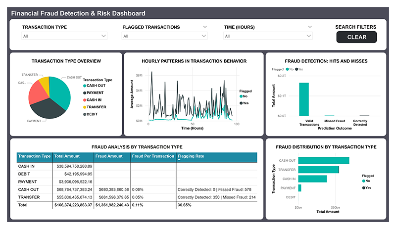
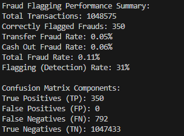

# Fraud Risk Analysis & Visualization

## Business Problem
How can a financial institution accurately detect fraudulent transactions in real-time to minimize financial losses and protect customers?

Understanding the factors behind fraudulent transactions allows financial institutions to:

- Minimize financial losses due to fraud
- Protect customers and build trust
- Design better fraud prevention and monitoring systems

## The Dataset

| Column             | Description                                                                                     |
|--------------------|-------------------------------------------------------------------------------------------------|
| `step`             | Time step of the transaction. Each step represents an hour.                                     |
| `type`             | Type of transaction: PAYMENT, CASH_OUT, TRANSFER, DEBIT                                         |
| `amount`           | Amount of money involved in the transaction                                                     |
| `nameOrig`         | Customer ID of the originator (sender)                                                          |
| `oldbalanceOrg`    | Account balance of the originator before the transaction                                        |
| `newbalanceOrig`   | Account balance of the originator after the transaction                                         |
| `nameDest`         | Customer ID of the destination (receiver)                                                       |
| `oldbalanceDest`   | Account balance of the destination before the transaction                                       |
| `newbalanceDest`   | Account balance of the destination after the transaction                                        |
| `isFraud`          | Indicates if the transaction is fraudulent (1) or not fraudulent (0)                            |
| `isFlaggedFraud`   | Indicates if the transaction was flagged as fraudulent (1) or not fraudulent (0) by the system  |

This project uses the [PaySim1 dataset](https://www.kaggle.com/datasets/ealaxi/paysim1).

**Important Notes:** 
   - Transactions identified as fraudulent are cancelled in this dataset. This means the balance columns (`oldbalanceOrg`, `newbalanceOrig`, `oldbalanceDest`, `newbalanceDest`) do not reflect actual account changes for fraudulent transactions.

   - `TRANSFER` transaction types over $200,000 are flagged as fraudulent. This business rule is designed to catch unusually large transfers that may indicate fraudulent activity.

## Approach

### Tools & Technologies Used
- **Excel** – For data cleaning and validation.
- **Power BI** - For data cleaning and validation. Data visualization and dashboard creation.
- **Python** - Used to develop and evaluate the fraud detection process and system.

### Data Cleaning and Validation

1. **Rename Columns**

| Original Column      | New Column                      |
|----------------------|---------------------------------|
| `step`               | Time Step (Hour)                |
| `type`               | Transaction Type                |
| `amount`             | Amount                          |
| `nameOrig`           | Origin Account                  |
| `oldbalanceOrg`      | Origin Balance Before           |
| `newbalanceOrig`     | Origin Balance After            |
| `nameDest`           | Destination Account             |
| `oldbalanceDest`     | Destination Balance Before      |
| `newbalanceDest`     | Destination Balance After       |
| `isFraud`            | Is Fraudulent                   |
| `isFlaggedFraud`     | Was Flagged Fraudulent          |

2. Checked for blanks: None found.

3. Checked that all values in the Transaction Type column are in uppercase.

4. Dropped account ID columns: 
   - `Origin Account`
   - `Destination Account`
  
These columns only identify user accounts and don’t provide useful information for detecting fraud.

5. Checked for any negative and zero values in `Amount` column.

6. **Verified columns contain numeric values:**
   - `Time Stamp`
   - `Amount`
   - `Origin Balance Before`
   - `Origin Balance After` 
   - `Destination Balance Before`
   - `Destination Balance After`
   - `Is Fraudulent`
   - `Was Flagged Fraudulent`

7. **Removed Underscores in Transaction Types**

| Transaction Type Column    | New Transaction Type Column |
|----------------------------|-----------------------------|
| CASH_OUT                   | CASH OUT                    |
| CASH_IN                    | CASH IN                     |

8. **Dropped all balance columns:**

   - `Origin Balance Before`
   - `Origin Balance After`
   - `Destination Balance Before`
   - `Destination Balance After`

Fraudulent transactions are canceled, so the balance columns show account states after cancellation. These columns were not used for fraud detection.

9. **Dropped remaining column:**

   - `Was Flagged Fraudulent`

Column removed due to the business rule flagging transfer transactions over $200,000.

10. **Add Flagged Column**

This column sets the business rule: Transfer accounts with an amount greater than $200,000 and marked as fraudulent (Is Fraudulent = 1) are flagged as high risk.

## Final Dataset Sample 

| Time Step (Hour) | Transaction Type | Amount    | Is Fraudulent | Flagged    |
|------------------|------------------|-----------|---------------|------------|
| 1                | PAYMENT          | 1000.00   | 0             | No         |
| 1                | TRANSFER         | 250000.00 | 1             | Yes        |
| 1                | CASH IN          | 3000.00   | 0             | No         |
| 1                | CASH OUT         | 4000.00   | 1             | No         |
| 1                | DEBIT            | 5000.00   | 0             | No         |

## Results

### Power BI Dashboard and Visual Insights

Data visualization: Exploring key factors behind fraudulent transactions.

  
*Click the image to see the full version.*

- `TRANSFER` transaction type had the highest amount of fraud — `$681,598,379.85 million`.
- `CASH OUT` transaction type was the next runner-up — `$680,383,860.58 million`.
- `CASH IN`, `PAYMENT`, and `DEBIT` had zero fraud.
- Total fraud cases by transaction type: `0.11%`
- Total fraud cases by transaction type is <1%, but the fraud amounts are large.

**Simulated Fraud Detection System with Business Rule**

  - The business rule flagged `31%` of cases as fraudulent. 
  - An issue was that the business rule caused some fraudulent transactions to go undetected.
  - There were no false alarms due to the business rule being strict.

## Key Business Insights

**Transfer Transactions and Detection**
  - Only `TRANSFER` transactions are subject to flagging. Fraud was detected exclusively within `TRANSFER` transactions where amounts exceed $200,000.
  - `CASH OUT` had fraudulent cases, but some were not detected. These are considered missed frauds.
  - `TRANSFER` and `CASH OUT` are high risk concentration zones even though they make up a small percentage of transactions.
  - Fraud transactions are not frequent. When they occur, they often involve very large amounts with high bursts of high-value transaction attempts.
 
**Cash In, Payment, Debt Transaction Types**
  - `CASH IN`, `PAYMENT`, and `DEBIT` had zero fraudulent transactions.

**Time-Based (Hourly) Fraudulent Activity**
  - Fraud spikes tend to happen unpredictably, indicating coordinated activity rather than random occurrences.
  - Fraud is not evenly distributed over time. Certain hours have heavier fraud activity.

**Fraud Detection System**
  - The fraud detection system flagged `31%` of fraudulent transactions, demonstrating some ability to identify fraud when a business rule is applied.
  - While the business rule detected only `31%` of fraudulent transactions, it was still effective in identifying fraud cases. Additionally, minimizing false alarms helps ease the workload on investigators, prevent delays, and protects the customer experience.
  - `792` fraud cases went unnoticed, creating financial and reputational risks.
  - The current method relies solely on a transaction amount threshold, which doesn’t effectively capture complex fraud patterns or smaller fraudulent transactions.

## Summary of Recommendations Based on Findings

**Fraud Surveillance Across Transaction Types**
- Focus fraud detection on `TRANSFER` and `CASH OUT` transaction types.
- Maintain fraud checks for `CASH IN`, `PAYMENT`, and `DEBIT` transaction types.
  
**Enhance Real-Time Rules for Suspicious Behavior/Patterns**
  - Implement flags across scenarios: 
    - When funds are transferred and cashed out immediately.
    - Flag transactions that fall within certain value ranges.

**Observe Event Timing and Frequency**
  - Limit the number of transfers and cash outs per account within a day or hourly to detect unusual activity.
  - Lock accounts when time-based bursts are detected.
  - Utilize dashboards to monitor hourly fluctuations in transaction activities for both fraudulent and non-fraudulent transactions.
  - A sudden rise in fraud amounts can be an early sign of a new scam starting.

**Monitor Account Balance Changes**
  - Watch for patterns where funds are transferred from empty accounts.
  - Watch for accounts that are quickly depleted right after receiving money.

**Add Behavioral Modeling**
  - Train fraud detection models on `TRANSFER` and `CASH OUT` transaction types.
  - Add and enforce verification steps for `TRANSFER` and `CASH OUT` transaction types for new accounts or shortly after transfers.

**Improve Fraud Detection System**
  - Combine multiple features (machine learning, statistical models) to increase accuracy to reduce missed frauds and false alarms. Examples:
    - Transaction type, timing, and frequency
    - Account activity and historical behavior
    - Origin and destination patterns
  - Establish varying risk levels, prioritizing transactions with higher risk.
  - Continuously improve the fraud detection system by updating it based on feedback from confirmed fraud cases.
  - Set up simple and fast procedures for flagged transactions to maintain customer satisfaction, including quick solutions and communication.

## Author
Jennifer Nguyen